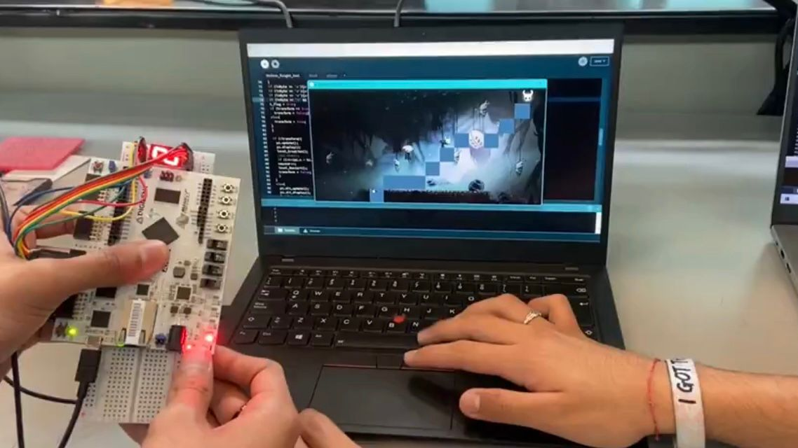

# Accelerometer controlled videogame

This is a 2D collaborative game, developed by me and my teammate, which is
inspired by the Hollow Knight game. The objective is to capture the 3 masks that
appear on top of the map. The first player moves the character and has the
ability to transform it through the movement of an accelerometer connected to an
FPGA Arty board. The second player uses the mouse to create platforms that the
character uses to reach the masks. There is a 7-segment display attached to the
Arty, which displays the current score. There are 4 LED indicators on the Arty,
which show the state of the movement (left, right, still) on red, and the
transformation on green.

You can find a full explanation of the details and demo video in the
[GitHub repository](https://github.com/OshkarVTec/2D-accelerometer-controlled-videogame)

