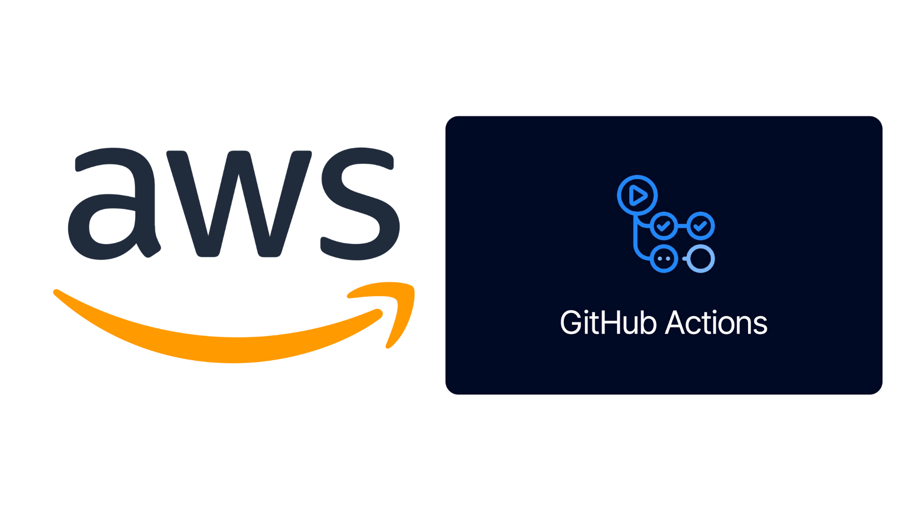

# Latin Food registration platform

I was part of the team in charge of the development of the web platform for the
registration process of Latin Food 2024, an event organized by the Mexican
Association of Food Science (AMECA). My responsibilities included designing the
platform's architecture, developing the automated deployment pipeline on AWS
using GitHub Actions, and providing consulting for backend and frontend
development.

The project was fully managed by me and the team as a freelancing project.

The platform is no longer available, as the event was held in November 2024.

