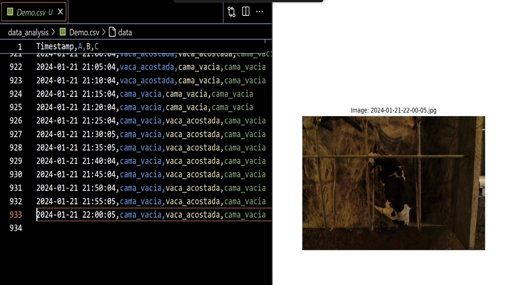

# AI for Analyzing Cow Rest Patterns

We collaborated with the Experimental Agricultural Field of Tec de Monterrey
(CAETEC) to develop an AI model based on neural networks. This model analyzes an
image to determine if a sand bed is empty or occupied by a cow, and it can
distinguish between a standing and a lying cow. The results are stored in a CSV
file for further analysis. The model was tested on a Raspberry PI 3 to account
for the existing infrastructure in the CAETEC. Additionally, we developed a
desktop application, using React and Electron, to streamline the configuration
and selection of beds to analyze.

Here is a screenshot of the UI for bed selection:

And a screenshot of the whole project on live:

