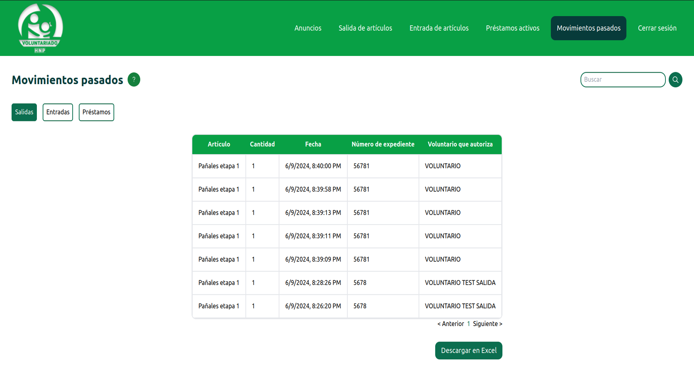

# Donations Manager

A web app developed for Albergue del Hospital del Niño Poblano (Poblano
Children's Hospital Shelter) to manage their donations. You can add donations
and see reports of past transactions, as well as download the information in a
CSV file. Built on React and Django. Deployed on a local server using Docker.
The web supports different user roles

