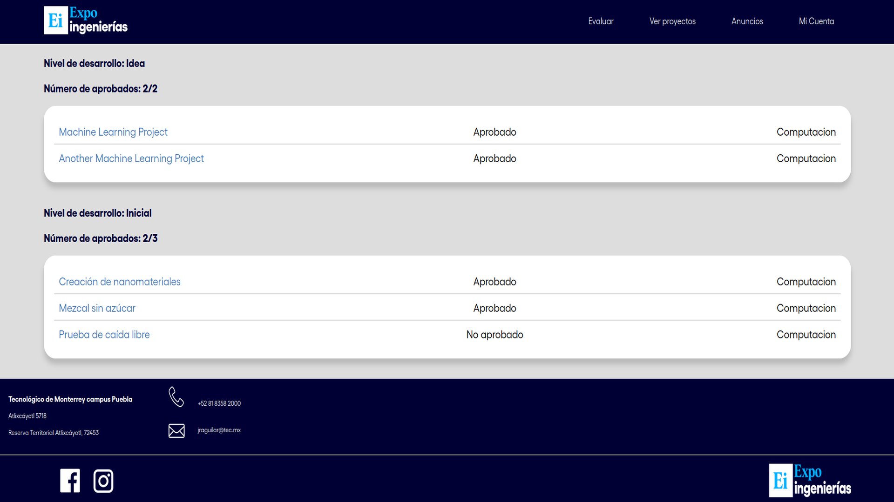

# Engineering Expo Website

I worked on a project to develop a website for the administration of the
Engineering Expo at Tec de Monterrey in Puebla. As a part of the project, I was
responsible for developing the database, as well as working on the backend and
frontend development of the site. I was involved in the entire process of
creating the website, from the initial planning to the final implementation.
This project allowed me to gain valuable experience in web development, project
management, and teamwork.

