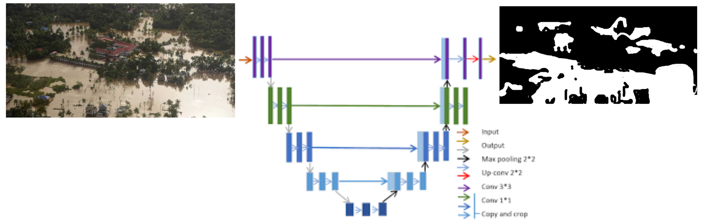
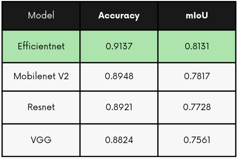
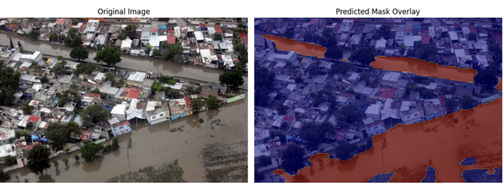

# Flood detection using AI

I developed an AI model based on neural networks for detecting flooded areas in
aereal images. The model is based on the architecture _U-Net_, a type of
convolutional neural network (CNN) architecture that is particularly well-suited
for image segmentation tasks. The architecture contains an encoder and a
decoder. The encoder extracts data from the original image, and the decoder uses
that information to construct the output image. In this case, the output image
is a mask that indicates the flooded areas.

My project compares the results of using four different pre-trained enconders:

- Resnet
- VGG
- Mobilenet v2
- Efficientnet

The best fitted model was the one that used _Resnet_ as indicated in the table
below:

The model can be used to detect flooded areas in images that it has never seen.
Here is an example of a photo from Querétaro, México:

## GitHub Repository

You can find the code and a full report in spanish in the
[GitHub repository](https://github.com/OshkarVTec/deep-learning-flood-segmentation).
