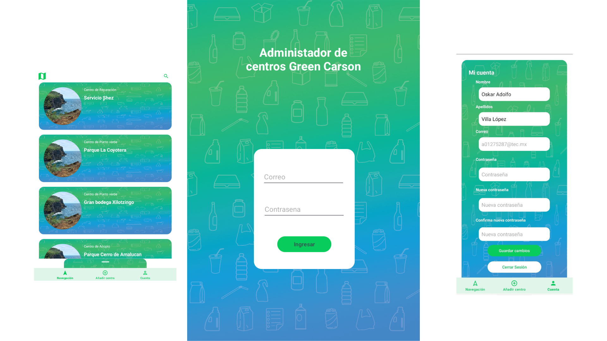

# Reciclapp

I contributed to the development of the "Center Administrator" app for
Reciclapp, an initiative by the Green Carson foundation. This internal tool
allows foundation members to add recycling, collection, and similar centers,
marking them on a map for public access to promote recycling habits. My role
included designing the user interfaces, planning the app's architecture,
developing the Android version, and managing its deployment.

