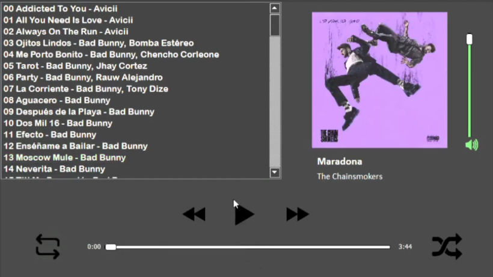

# Raspberry Pi Music Player

I worked on a project to develop an MP3 music player with a graphical interface
using Python. The goal was to simulate the entertainment interface of a car with
a display screen. The project was implemented on a Raspberry Pi4 and included a
connection with an Arduino to read user inputs from buttons. Through this
project, I gained experience programming with consideration for hardware and
embedded systems. It was an exciting opportunity to work on a project that
involved both software and hardware development, and it helped me to develop my
problem-solving and critical thinking skills.

You can find the details of the project and a video demo in the
[GitHub repository](https://github.com/OshkarVTec/Raspberry-Pi-4-music-player)

