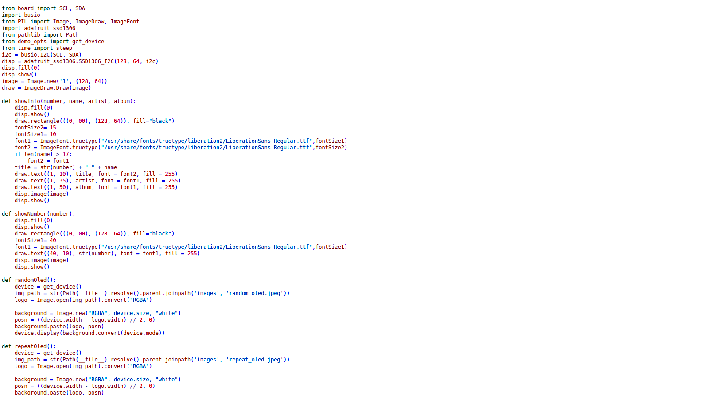

I developed a syntax highlighter that takes a Python script and generates an
output HTML file. The HTML file, paired with a CSS stylesheet, displays the code
with correct syntax highlighting. The code is written in Elixir, and contains
some Erlang code with the Leex library.

You can find the project on
[GitHub](https://github.com/OshkarVTec/python-syntax-highlighter).

