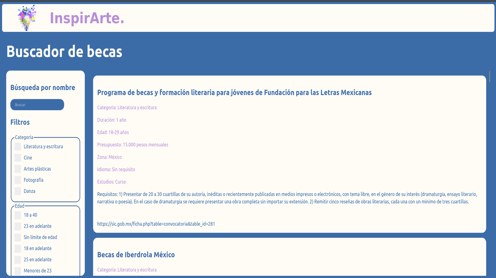

A web app where you can search for scholarships, applying filters and using a
text search. Built on React using Vite. Deployed on GitHub Pages.

The live page can be found [here](https://oshkarvtec.github.io/webBecas/)

You can find the project on [GitHub](https://github.com/OshkarVTec/webBecas).

